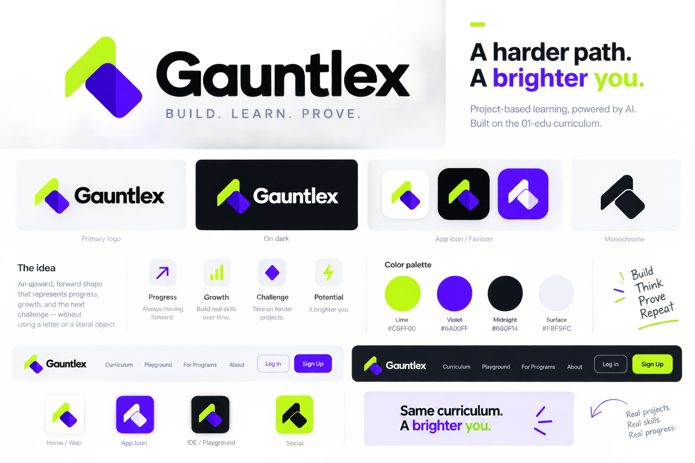

# Gauntlex — Project Description

### What it is
Gauntlex is an AI-guided, project-based coding education platform. It delivers the 01-edu curriculum (the same system used by Zone01, 01Founders, and other 42-network schools) to users sequentially — one task at a time — because the curriculum's tasks are designed to build on each other. It is not a course catalog; users cannot skip around.
Unlike traditional course platforms (videos, reading, quizzes), the 01-edu curriculum is project-based and deliberately ambiguous: users are given a real problem and must work out the solution themselves, with no answer key.
Gauntlex replaces the traditional human peer-audit process (used at 01-edu schools) with two distinct AI roles.

### Core loop
1. Task unlocked — user sees the current subject's brief (pulled from the curriculum's README + resources).
2. User works independently, self-testing their code freely and informally as many times as they want (not tracked by the platform).
3. AI Guide is available throughout via chat. It uses the Socratic method: it never gives the answer or working code. It asks clarifying/probing questions, points at concepts, and makes the user articulate their own reasoning. Hint strength escalates with each failed attempt on that task (light nudge → probing question → near-explicit pseudocode, but never runnable code). The Guide's context includes the subject's README but explicitly NOT the audit questions.
4. User submits their code when ready.
5. Server-side test validation — the platform independently re-runs the subject's real test suite in an isolated sandbox (Docker). It does not trust the user's local "it works" claim. This is the source of truth.
   * Fail → submission rejected, user returns to the Guide (which now has this attempt logged, and escalates help).
   * Pass → proceeds to AI Audit.
6. AI Auditor — given the subject's audit questions (from the curriculum) plus the user's actual submitted code, it generates 3-5 targeted questions to verify real understanding (not just passing tests) — similar in spirit to an oral defense. Questions vary in phrasing per attempt so they aren't memorizable.
   * Pass → task marked complete, next subject unlocks (by order_index).
   * Fail → user returns to the Guide with escalated help, retries the same task.

### Key design principles

* AI Guide and AI Auditor never share context. The Guide must never see audit questions; the Auditor evaluates independently of the Guide's conversation.
* The platform's test execution is authoritative, not the user's self-reported results.
* No permanent lockout on failure — failing routes back into more support (escalated Guide help), not a dead end.
* Curriculum content: sourced from the 01-edu curriculum repo (confirmed usable via Learn2Earn's partnership with 01-edu).

### Tech stack

* Frontend: Vite + React
* Backend: GO
* Database: neon
* AI: 
* Auth: Clerk
* Code execution: Docker-based sandbox for running each subject's own test suite in isolation
* Hosting: Vercel, render  "gauntlex.vercel.app" 

### Naming
"Gauntlex" = gauntlet (running a sequential gauntlet of challenges) + codex/lex (law/rules, code). The name reflects the platform's core idea: progress is earned by proving understanding at every gate, not by passive consumption.